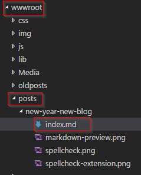
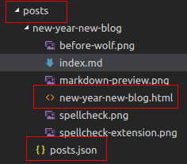

# wolf

```
/\_/\  wolf
|` ´|
 \-/   markdown to static blog post generator
```

**wolf** is a small and simple *Markdown* to *HTML static content* conversion 
tool.

It tries to follow the *Unix Tools Philosophy* of *"doing just one thing
and doing it well"*. Therefore, all it does is reading *Markdown* files
and spitting out *HTML* files. Nothing more, nothing less. No integrated web server,
no project template, just static content generation.

## Usage (CLI)

Typically, you run the *wolf* executable inside the **wwwroot** folder of your web application.
By default, *wolf* looks for a folder called **posts** that contains the
subfolders with the individual blog posts. Such a subfolder's name also acts as the
**slug** (URL route) of the blog post. A matching* *Markdown (.md)* file
in this folder will be converted to HTML.

*) "*Matching*" means an *.md* file named "index.md", "default.md", "post.md" or "<FOLDER_NAME>.md".

Of course, your mileage may vary and you are probably using *different folder
names* in your project. These are the command line options to change the default behavior.

```
Usage: wolf [options]

Options:
  -i | --inputDirectory <directory>   Input directory of blog posts
  -o | --outputDirectory <directory>  Output directory of blog posts
  -x | --indexDirectory <directory>   Directory where index (posts.json) file is written
  -p | --imagePrefix <prefix>         Prefix added to image paths.
  -t | --tagFile                      Generate 'tags.json' file.
  -v | --verbose                      Show detailed output.
  -n | --nologo                            Do not display logo.
  -? | -h | --help                    Show help information
```

So this is how the **posts** folder looks *before* running the *wolf* conversion.



This is *after* the *wolf* conversion.



As we can see, we now have an additional *.html* file per blog post as well
as a  **posts.json** file containing the metadata for all blog posts.

```json
[
  {
    "slug": "new-year-new-blog",
    "title": "New Year, New Blog",
    "published": "2017-01-18T18:00:00",
    "tags": [
      "Blogging",
      "ASP.NET",
      "DotNetCore",
      "Linux",
      "Orchard",
      "Markdown"
    ]
  }
  ...
]
```

This JSON file can easily be parsed in the web application to get a list of
available blog posts.

You can reuse the `Post` class from this project for that.

Deserialization can then be as simple as that:

```csharp
public class PostRepositoryLoader
{
  public JsonRepositoryLoader(string fileName)
  {
    _fileName = fileName;  // path to "posts.json"
  }

  public List<Post> Load()
  {
    return JsonConvert.DeserializeObject<List<Post>>(File.ReadAllText(_fileName));
  }
}
```

## Usage (API)

... to come

## NuGet

... to come

## Dependencies

**wolf** uses [Markdig](https://github.com/lunet-io/markdig) for the actual
*Markdown* to *HTML* conversion.